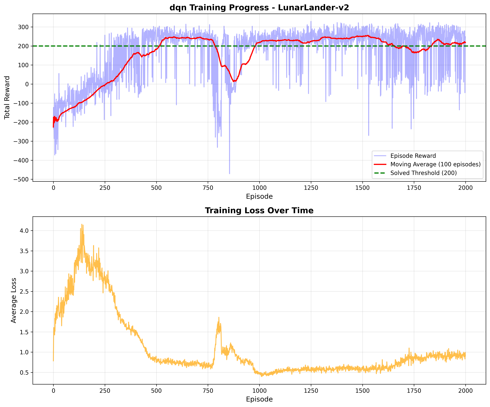
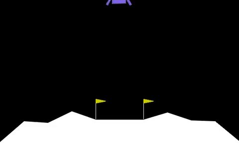
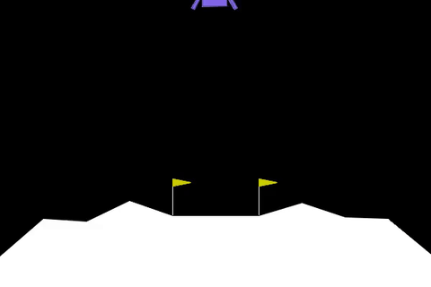
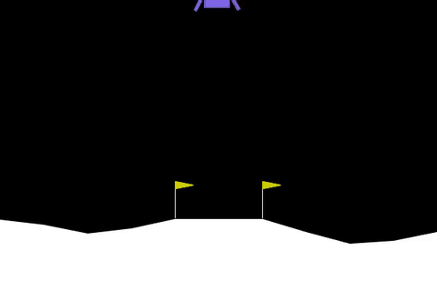
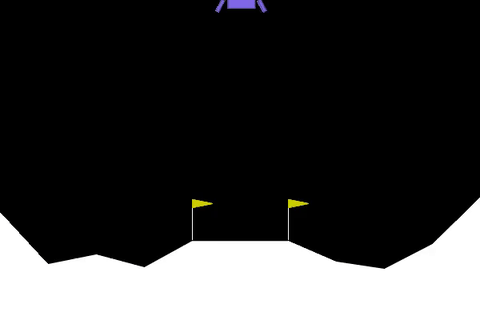
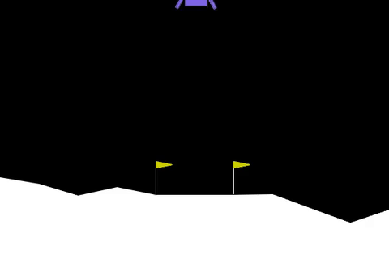
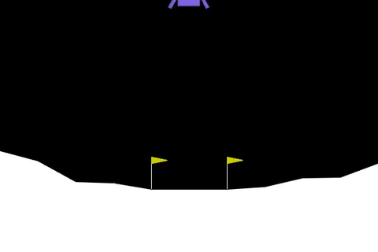

# 🚀 LunarLander - Deep Reinforcement Learning

[](https://www.python.org/)
[](https://pytorch.org/)
[](https://gymnasium.farama.org/)
[](https://www.docker.com/)

A production-ready implementation of both Deep Q-Networks (DQN) and Double Deep Q-Networks (DDQN) for solving the LunarLander-v2 environment from Gymnasium. This project demonstrates advanced deep reinforcement learning techniques including experience replay, target networks, epsilon-greedy exploration, and overestimation bias reduction.

## 📋 Table of Contents

- [Overview](#-overview)
- [Project Structure](#-project-structure)
- [Algorithm Comparison](#-algorithm-comparison)
- [Neural Network Architecture](#-neural-network-architecture)
- [Key Features](#-key-features)
- [Results](#-results)
- [Hyper-parameters](#-hyper-parameters)
- [Installation Options](#-installation-options)
- [Usage](#-usage)
- [Docker Support](#-docker-support)
- [Future Improvements](#-future-improvements)

## 🎯 Overview

The agent must learn to land a spacecraft safely on a landing pad using discrete controls (thrusters).

**Environment Details:**
- **State Space:** 8 dimensions (position, velocity, angle, angular velocity, leg contact)
- **Action Space:** 4 discrete actions (do nothing, left engine, main engine, right engine)
- **Reward:** +100 for landing, -100 for crashing, fuel consumption penalties
- **Solved Criteria:** Average reward ≥ 200 over 100 consecutive episodes

## 📁 Project Structure

```
lunar-lander-dqn/
├── agent.py               # DQN and DDQN agents implementation
│   ├── DQN (nn.Module)    # Neural network architecture
│   ├── ReplayBuffer       # Experience replay buffer
│   └── DQNAgent           # Main agent class
├── train.py               # Training script
├── evaluate.py            # Evaluation script
├── test_dqn.py            # Unit tests script for the project
├── config.py              # Configurations of the LunarLander project
├── convert_videos.py      # convert recorded videos to GIFs
├── analysis.ipynb         # analysis for the trained agents
├── requirements.txt       # Python dependencies
├── Dockerfile            # Docker container definition
├── docker-compose.yml    # Docker compose configuration
├── README.md             # This file
├── models/               # Saved model checkpoints
│   ├── double_dqn/       # Double DQN save model, its checkpoints and metadata
│   ├── dqn/              # DQN saved model, its checkpoints and metadata
│   └── training_history.json
├── plots/                # Training visualizations
│   ├── double_dqn/       # .png plots for the DDQN, results and reward curves
│   └── dqn/              # .png plots for DQN
├── assets/videos/        # GIFs for the recorded videos
└── logs/                 # Training logs
```


## 🧠 Algorithm Comparison

This project implements and compares:

- **Deep Q-Network (DQN)**

- **Double Deep Q-Network (DDQN)**

Both are value-based reinforcement learning algorithms that approximate the optimal action-value function Q*(s,a) using deep neural networks.

### 1️⃣ DQN Update Rule

```
Q(s, a) ← Q(s, a) + α[r + γ max Q(s', a') - Q(s, a)]
                              a'
```

Where:
- `s, a`: current state and action
- `r`: reward received
- `s'`: next state
- `γ`: discount factor (0.99)
- `α`: learning rate (0.001)

DQN uses the **target network** to both:

- Select the best next action

- Evaluate its value

⚠️ This can lead to overestimation bias, where Q-values are systematically overestimated.

### 2️⃣ Double DQN (DDQN) Update Rule

Double DQN decouples action selection from evaluation:

```code
a* = argmax Q_policy(s', a')
y  = r + γ Q_target(s', a*)
```

✅ Key difference:

- Action selection → policy network

- Action evaluation → target network

This reduces overestimation bias and improves training stability.

### Key Components

1. **Experience Replay Buffer**
   - Stores transitions (s, a, r, s', done) in a circular buffer
   - Breaks correlation between consecutive samples
   - Improves sample efficiency and training stability
   - Capacity: 100,000 transitions

2. **Target Network**
   - Separate network for computing target Q-values
   - Updated every 10 training steps
   - Stabilizes training by providing fixed targets
   - Prevents oscillation and divergence

3. **Epsilon-Greedy Exploration**
   - Balances exploration vs exploitation
   - ε starts at 1.0 (random actions)
   - Decays by 0.995 per episode
   - Minimum ε = 0.01

## 🏗️ Neural Network Architecture

```
Input (8) → Dense(128) → ReLU → Dense(128) → ReLU → Output(4)
```

**Architecture Details:**
- **Input Layer:** 8 neurons (state dimensions)
- **Hidden Layer 1:** 128 neurons with ReLU activation
- **Hidden Layer 2:** 128 neurons with ReLU activation
- **Output Layer:** 4 neurons (Q-values for each action)

**Optimization:**
- **Optimizer:** Adam
- **Learning Rate:** 0.0001
- **Loss Function:** Smooth L1 Loss (Huber Loss)
- **Gradient Clipping:** Max norm of 1.0
- **Batch Size:** 64

## ✨ Key Features

- **Production-Ready Code:** Clean, modular, and well-documented
- **Experience Replay:** Efficient memory buffer with random sampling
- **Target Network:** Stabilized training with periodic updates
- **Epsilon Decay:** Adaptive exploration schedule
- **Gradient Clipping:** Prevents exploding gradients
- **Model Checkpointing:** Saves best and periodic checkpoints
- **Comprehensive Logging:** Training metrics and visualizations
- **Docker Support:** Reproducible environment setup
- **Evaluation Metrics:** Detailed performance analysis
- **GPU Support:** Automatic CUDA detection and usage


### Evaluation & Recording

**Evaluate trained model:**
```bash
python evaluate.py --model ./models/dqn/best_model.pth --episodes 100
```

**Run single test episode with visualization:**
```bash
python evaluate.py --model ./models/double_dqn/best_model.pth --test --render
```

**Record video:**
```bash
python evaluate.py --model ./models/double_dqn/best_model.pth --episodes 3 --record
```

***Run a successfully best trained model with maximum reward and record its video***
```bash
python evaluate.py --record-success
```

**Docker Evaluation:** 
```bash
# requires xvfb to be configured in docker-compose
docker-compose --profile evaluation up dqn-evaluation
```

## 📊 Results

### Training Progress

After training for 2000 episodes, for the both algorithms with identical hyperparameters:

**DQN Performance**
- **Best Average Reward (100 episodes):** ~240–260
- **Success Rate:** ~79-84%
- **Episodes to solve:** ~900–1200
- **Reward Variance:** Moderate

**Double DQN Performance**
- **Best Average Reward (100 episodes):** ~260–280
- **Success Rate:** ~96–100%
- **Episodes to Solve:** ~800–1000
- **Reward Variance:** Lower
- **Training Stability:** Improved

### Training Curves

The result curves for both DQN and Double-DQN.

DDQN demonstrates smoother convergence and higher stability compared to standard DQN.

<div style="display: flex; justify-content: space-around;">
  <div>
    <p><b>DQN Results Curve</b></p>
    
  </div>
  <div>
    <p><b>Double DQN Results Curve</b></p>
    
  </div>
</div>

**📈 Learning Behavior Comparison**
| Training Phase | DQN                         | DDQN                           |
| -------------- | --------------------------- | ------------------------------ |
| 0–500 Episodes | High exploration            | High exploration               |
| 500–1000       | Rapid but noisy improvement | Rapid and smoother improvement |
| 1000–2000      | Occasional oscillations     | Stable convergence             |

### Visual Performance Comparison
Videos were recorded during evaluation and converted to GIFs for display.

<div style="display: flex; flex-direction: column; gap: 20px;">

  <!-- Row 1 -->
  <div style="display: flex; align-items: center; gap: 20px;">
    <div style="width: 100px;"><b>Episode 1</b></div>
    <div style="flex: 1; text-align: center;">
      <p><b>DQN</b></p>
      
    </div>
    <div style="flex: 1; text-align: center;">
      <p><b>Double DQN</b></p>
      
    </div>
  </div>

  <!-- Row 2 -->
  <div style="display: flex; align-items: center; gap: 20px;">
    <div style="width: 100px;"><b>Episode 2</b></div>
    <div style="flex: 1; text-align: center;">
      
    </div>
    <div style="flex: 1; text-align: center;">
      
    </div>
  </div>

  <!-- Row 3 -->
  <div style="display: flex; align-items: center; gap: 20px;">
    <div style="width: 100px;"><b>Episode 3</b></div>
    <div style="flex: 1; text-align: center;">
      
    </div>
    <div style="flex: 1; text-align: center;">
      
    </div>
  </div>

</div>

## ⚙️ Hyper-parameters

| Parameter | Value | Description |
|-----------|-------|-------------|
| Learning Rate | 0.0001 | Adam optimizer learning rate |
| Gamma (γ) | 0.99 | Discount factor for future rewards |
| Epsilon Start | 1.0 | Initial exploration rate |
| Epsilon End | 0.01 | Minimum exploration rate |
| Epsilon Decay | 0.995 | Decay rate per episode |
| Batch Size | 64 | Number of transitions per update |
| Buffer Capacity | 100,000 | Max replay buffer size |
| Target Update Freq | 10 | Steps between target network updates |
| Hidden Dimension | 128 | Neurons in hidden layers |
| Max Episode Steps | 1000 | Maximum steps per episode |

### Tuning Recommendations

**For faster learning:**
- Increase learning rate to 0.005
- Increase batch size to 128
- Decrease epsilon decay to 0.99

**For more stable training:**
- Decrease learning rate to 0.0005
- Increase target update frequency to 20
- Increase buffer capacity to 200,000

## 🔬 Technical Details

### DQN Algorithm Flow

1. **Initialize** policy and target networks with random weights
2. **Initialize** replay buffer D
3. **For each episode:**
   - Reset environment, get initial state s
   - **For each step:**
     - Select action a using ε-greedy policy
     - Execute action, observe reward r and next state s'
     - Store transition (s, a, r, s', done) in D
     - Sample random minibatch from D
     - Compute target: y = r + γ max Q_target(s', a')
     - Update policy network: minimize (y - Q_policy(s, a))²
     - Every C steps: update target network
   - Decay ε

### Double DQN Algorithm Flow

1. Initialize policy and target networks
2. Store transitions in replay buffer
3. Select best next action using policy network:

      ```code
      a* = argmax Q_policy(s', a')
      ```
4. Evaluate using target network:

      ```code
      y = r + γ Q_target(s', a*)
      ```
5. Minimize TD error
6. Periodically update target network

### Loss Function

I used Smooth L1 Loss (Huber Loss) for better stability:

```python
L = {
  0.5 * (y - Q(s,a))²           if |y - Q(s,a)| ≤ 1
  |y - Q(s,a)| - 0.5            otherwise
}
```

This is less sensitive to outliers than MSE while maintaining differentiability.

### Gradient Clipping

To prevent exploding gradients:

```python
torch.nn.utils.clip_grad_norm_(parameters, max_norm=1.0)
```

## 📦 Installation Options

### 1. Local Installation

```Bash
# Clone the repository
git clone https://github.com/saintjeane/lunar-lander-deep-rl.git
cd lunar-lander-dqn

# Create virtual environment
python -m venv venv
source venv/bin/activate  # On Windows: venv\Scripts\activate

# Install dependencies
pip install -r requirements.txt
```

### 2. Docker Installation

```Bash
# Build the Docker image
docker-compose build

# Or use pre-built image (if available)
docker pull sainte/lunar-lander-deep-rl:latest
```

### 3. Automated Setup using `setup.sh`

```Bash
# First clone the repository and then run the command once
chmod +x setup.sh
./setup.sh
```

Then activate the virtual environment manually
```Bash
# Linux/macOS
source venv/bin/activate

# Windows (PowerShell/Git Bash)
source venv/Scripts/activate
```

## 🚀 Usage

### Training

**Local Training:**
```Bash
python train.py # defaults to standard dqn
python train.py --double-dqn # trains the double dqn agent
```
You can also train the agents with the desired hyperparameters (check `train.py` script for the CLI commands - commented out)

**Docker Training:**
```Bash
docker-compose up dqn-training
```

Training will:
- Run for 2000 episodes (configurable)
- Save checkpoints every 500 episodes
- Save the best model based on 100-episode moving average
- Generate training plots in `./plots/`
- Save training history in `./models/training_history.json`

### Workflow shortcuts with `Makefile`

The Makefile provides convenient commands for common tasks:

```Bash
make setup      # Run setup.sh to initialize environment
make install    # Install dependencies
make train      # Train the agent
make evaluate   # Evaluate agent with best model
make unit-test  # Run unit tests
make format     # Format project using black
make clean      # Remove logs, plots, videos, and assets
make help       # Show available commands
```

## 🐳 Docker Support

### Build and Run

```bash
# Build image
docker-compose build

# Train agent
docker-compose up dqn-training

# Evaluate agent
docker-compose --profile evaluation up dqn-evaluation
```

To enable video recording within Docker, the dqn-evaluation service uses xvfb-run to simulate a display buffer.

```YAML
# docker-compose.yml excerpt
dqn-evaluation:
    # ...
    command: xvfb-run -s "-screen 0 1024x768x24" python evaluate.py --model ./models/best_model.pth --record
```

### Volume Mounts

The Docker setup includes volume mounts for:
- `./models/` - Model checkpoints persist across runs
- `./plots/` - Training visualizations
- `./videos/` - Recorded evaluation episodes
- `./logs/` - Training logs

### Custom Configuration

To modify training parameters, edit `config.py` or pass environment variables:

```yaml
# In docker-compose.yml
environment:
  - NUM_EPISODES=3000
  - LEARNING_RATE=0.0005
```

## 🎯 Future Improvements

### Algorithmic Enhancements

1. **Dueling DQN**
   - Separate value and advantage streams
   - Better representation of state values
   - Particularly useful for states with similar action values

2. **Prioritized Experience Replay**
   - Sample important transitions more frequently
   - Use TD-error as priority metric
   - Improves sample efficiency

3. **Noisy Networks**
   - Replace ε-greedy with parametric noise
   - Learn exploration strategy
   - Better for hard exploration problems

4. **Rainbow DQN**
   - Combines multiple DQN improvements
   - State-of-the-art performance
   - Includes all above enhancements plus more

### Engineering Improvements

- **TensorBoard Integration** for real-time monitoring
- **Hyperparameter Optimization** using Optuna
- **Multi-environment Training** for generalization
- **Distributed Training** for faster convergence
- **A/B Testing Framework** for algorithm comparison

## 📄 License

This project is licensed under the MIT License - see the LICENSE file for details.

## 👤 Author

- GitHub: [@SaintJeane](https://github.com/SaintJeane)
- LinkedIn: [Peter Jaimbo](https://linkedin.com/in/peterjaimbo)

## 🙏 Acknowledgments

- OpenAI Gymnasium for the LunarLander environment
- PyTorch team for the deep learning framework
- DeepMind for the DQN algorithm
- The reinforcement learning community

---